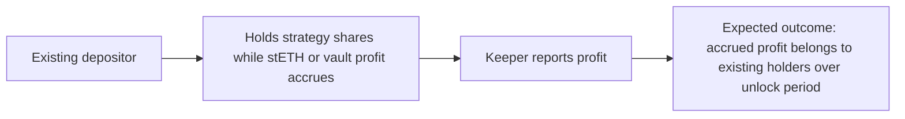
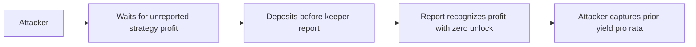
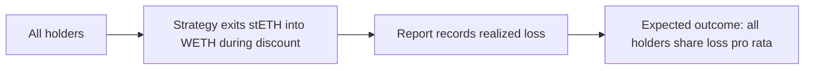
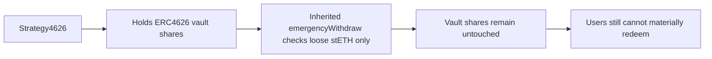

# Smart Contract Security Assessment Report

## Executive Summary

Protocol Purpose: Yearn V3 TokenizedStrategy implementation for accumulating stETH from WETH deposits, with an optional Strategy4626 variant that wraps stETH to wstETH and deposits into an ERC4626 vault.

Industry Vertical: Yield strategy, liquid staking token accumulation, ERC4626 integration.

User Profile: Depositors holding Yearn strategy shares; Yearn management, keeper, and emergency roles operate staking, reports, manual swaps, withdrawal queue claims, and emergency exits.

Total Value Locked: Not established from repo-local context. Findings are calibrated by exploit mechanics rather than assumed TVL.

Overall Risk Level: Medium.

Total Findings: 4 Medium, 2 Low.

Primary risk areas:
- stale Yearn accounting around reports and manual liquidity creation
- emergency/shutdown paths that can fail or undo recovery
- Strategy4626 factory configuration and ERC4626 unwind assumptions
- low-severity keeper/oracle integration consistency issues

## Table of Contents - Findings

### Medium Findings

- M-01 Existing depositors' accrued yield can be diluted by pre-report deposits because factory deployments disable profit locking
- M-02 Manual LST-to-WETH swaps expose discounted liquidity before accounting records the loss
- M-03 Post-shutdown reports can re-stake emergency-withdrawn WETH and block withdrawals again
- M-04 Strategy4626 emergencyWithdraw does not materially free the normal ERC4626-held position

### Low Findings

- L-01 Lido withdrawal initiation returns an encoded array but keeper claim decodes a scalar request id
- L-02 StrategyAprOracle returns a fixed APR for every strategy and debt delta

## Detailed Findings

## M-01 Existing depositors' accrued yield can be diluted by pre-report deposits because factory deployments disable profit locking

### Core Information

Severity: Medium

Probability: Medium

Confidence: High

Status: VALID

### User Impact Analysis

Innocent User Story:



Attack Flow:



### Technical Details

Locations:
- `src/Strategy4626Factory.sol:62-64`
- `src/BaseLSTAccumulator.sol:146-155`
- `src/Strategy4626.sol:69-75`

`Strategy4626Factory.newStrategy4626()` calls `setProfitMaxUnlockTime(0)` for every factory-created Strategy4626. The Yearn TokenizedStrategy default profit-locking period is therefore disabled. Deposits mint shares against the last reported `totalAssets`; meanwhile stETH, wstETH, and the configured ERC4626 vault can accrue value before `report()` recognizes it.

An attacker who deposits before a keeper report receives shares priced from stale accounting. When the report runs, `_harvestAndReport()` includes the current stETH/wstETH/vault value and the profit is immediately reflected in PPS because the unlock period is zero. The attacker receives part of profit earned before they deposited.

### Business Impact

This is yield theft/dilution rather than principal theft. Loss to existing users is approximately:

`attacker_deposit / (existing_assets + attacker_deposit) * unreported_profit`

The window is more valuable when deposits are open, report cadence is predictable, Lido/vault profit accrues between reports, or pending redemptions delay reports.

### Verification & Testing

PoC: `.audit/dot-context/outputs/1/FactoryProfitUnlockDilutionPoC.t.sol`

Command:

```sh
env ETH_RPC_URL=https://ethereum.publicnode.com forge test -vv --fork-url https://ethereum.publicnode.com --match-path src/test/FactoryProfitUnlockDilutionPoC.t.sol
```

Result: 1 test passed.

### Remediation

Do not set `profitMaxUnlockTime` to zero by default. Preserve a non-zero unlock period or enforce an operational flow that closes deposits, reports, and only then reopens deposits around material unreported profit.

Triager Note: VALID. PoC-backed Medium. The issue is not direct TVL drain, but the economic extraction path is concrete and repeatable.

## M-02 Manual LST-to-WETH swaps expose discounted liquidity before accounting records the loss

### Core Information

Severity: Medium

Probability: Medium

Confidence: High

Status: VALID

### User Impact Analysis

Innocent User Story:



Attack Flow:


### Technical Details

Locations:
- `src/BaseLSTAccumulator.sol:133-155`
- `src/BaseLSTAccumulator.sol:177-179`
- `src/BaseLSTAccumulator.sol:241-246`
- `src/Strategy.sol:74-81`

`manualSwapToAsset()` can realize a lower WETH amount than the strategy's prior nominal stETH value. The WETH becomes immediately available through `availableWithdrawLimit()` because that function returns `balanceOfAsset()`. However, Yearn `totalAssets` is not updated until a later `report()`.

Between the manual swap and the loss-recording report, an early redeemer can withdraw against stale PPS and avoid their share of the realized loss.

### Business Impact

This is an avoided-loss extraction window. A user who redeems first receives more than their pro-rata share of newly liquid WETH; later holders inherit the shortfall. The window is especially relevant during stETH discounts, Curve imbalance, emergency exits, or permissive `_minOut` usage.

### Verification & Testing

PoC: `.audit/dot-context/outputs/1/ManualSwapStaleAccountingPoC.t.sol`

Command:

```sh
env ETH_RPC_URL=https://ethereum.publicnode.com forge test -vv --fork-url https://ethereum.publicnode.com --match-path src/test/ManualSwapStaleAccountingPoC.t.sol
```

Result: 1 test passed.

### Remediation

Do not expose manually created WETH as withdrawable liquidity before accounting is updated. Options include:
- set a `liquidityPendingReport` flag that makes `availableWithdrawLimit()` return zero until report
- add an atomic management function that swaps and records the realized value
- use private/bundled execution for loss-producing exits
- avoid permissive `_minOut` values

Triager Note: VALID. PoC-backed Medium. The finding depends on a privileged manual swap, but the loss-shifting withdrawal is permissionless once liquidity appears.

## M-03 Post-shutdown reports can re-stake emergency-withdrawn WETH and block withdrawals again

### Core Information

Severity: Medium

Probability: Medium

Confidence: High

Status: VALID

### User Impact Analysis

Innocent User Story:


Attack Flow:


### Technical Details

Locations:
- `src/BaseLSTAccumulator.sol:146-155`
- `src/BaseLSTAccumulator.sol:158-163`
- `src/Strategy.sol:51-70`

TokenizedStrategy intentionally permits `report()` after shutdown so operators can record final losses and maintenance. BaseStrategy comments warn strategy implementations to avoid redeploying funds during post-shutdown reports.

`BaseLSTAccumulator._harvestAndReport()` does not check `TokenizedStrategy.isShutdown()`. It calls `_stake(Math.min(balanceOfAsset(), availableDepositLimit(address(this))))`, and `address(this)` is allowlisted by default. After emergencyWithdraw frees WETH, a report can stake that WETH back into stETH, making user withdrawals illiquid again.

### Business Impact

This can undo emergency recovery and delay withdrawals during an incident. The trigger is keeper/management-gated rather than permissionless, so Medium is appropriate: operationally serious, not an external direct drain.

### Verification & Testing

PoC: `.audit/dot-context/outputs/1/ShutdownReportRedeployPoC.t.sol`

Command:

```sh
env ETH_RPC_URL=https://ethereum.publicnode.com forge test -vv --fork-url https://ethereum.publicnode.com --match-path src/test/ShutdownReportRedeployPoC.t.sol
```

Result: 1 test passed.

### Remediation

In `_harvestAndReport()`, skip `_stake(...)` when `TokenizedStrategy.isShutdown()` is true. Add a shutdown regression test showing emergency-withdrawn WETH remains withdrawable after a post-shutdown report.

Triager Note: VALID. PoC-backed Medium. The issue requires a privileged keeper report, but it breaks the expected emergency withdrawal state.

## M-04 Strategy4626 emergencyWithdraw does not materially free the normal ERC4626-held position

### Core Information

Severity: Medium

Probability: Medium

Confidence: High

Status: VALID

### User Impact Analysis

Innocent User Story:


Attack Flow:



### Technical Details

Locations:
- `src/BaseLSTAccumulator.sol:158-163`
- `src/Strategy4626.sol:29-42`
- `src/Strategy4626.sol:69-75`
- `src/Strategy4626.sol:77-95`
- `src/Strategy4626.sol:103-115`

Normal Strategy4626 deposits stake to stETH, wrap to wstETH, and deposit wstETH into the configured ERC4626 vault. `Strategy4626.valueOfLST()` correctly includes loose stETH, loose wstETH, and vault assets for reporting. The inherited `_emergencyWithdraw()` does not use that ERC4626-aware value. It checks only `balanceOfLST()` and returns when raw stETH is zero.

### Business Impact

The standard Yearn emergency path does not unwind the normal Strategy4626 position. Operators can recover via `manualRedeem()` and `manualUnwrap()`, but relying on a multi-step manual sequence during an emergency increases delay and error risk.

### Verification & Testing

PoC: `.audit/dot-context/outputs/1/Strategy4626EmergencyNoopPoC.t.sol`

Command:

```sh
env ETH_RPC_URL=https://ethereum.publicnode.com forge test -vv --fork-url https://ethereum.publicnode.com --match-path src/test/Strategy4626EmergencyNoopPoC.t.sol
```

Result: 1 test passed.

### Remediation

Override `_emergencyWithdraw()` in Strategy4626 to call `_freeStETH(_amount)` or an emergency-specific ERC4626-aware unwind, then swap freed stETH to WETH. Keep manual functions as fallback, not the only practical path.

Triager Note: VALID. PoC-backed Medium. Manual recovery paths lower severity from High, but the standard emergency callback materially fails.

## L-01 Lido withdrawal initiation returns an encoded array but keeper claim decodes a scalar request id

### Core Information

Severity: Low

Probability: Medium

Confidence: High

Status: VALID

### Technical Details

Locations:
- `src/Strategy.sol:91-112`
- `src/BaseLSTAccumulator.sol:259-272`

`_initiateLSTWithdrawal()` returns `abi.encode(requestIds)` where `requestIds` is a `uint256[]`. `_claimLSTWithdrawal()` decodes `_claimData` as a scalar `uint256`. The existing tests decode the array first and re-encode `requestIds[0]`, which confirms direct use of the returned bytes is not self-consistent.

### Business Impact

Keeper automation that passes the initiation return bytes directly to `claimLSTWithdrawal()` can claim the wrong id or revert, leaving `pendingRedemptions` non-zero and blocking reports until manual correction.

### Remediation

Return `abi.encode(requestIds[0])` if only single-request withdrawals are supported, or update claim logic to decode and process `uint256[]`.

Triager Note: VALID Low. This is an operational/automation DoS, not theft.

## L-02 StrategyAprOracle returns a fixed APR for every strategy and debt delta

### Core Information

Severity: Low

Probability: Medium

Confidence: High

Status: VALID

### Technical Details

Location:
- `src/periphery/StrategyAprOracle.sol:28-32`

`aprAfterDebtChange(address _strategy, int256 _delta)` ignores both inputs and returns `4e16`.

### Business Impact

If this oracle is wired into production allocation, it can route debt based on stale assumptions for shutdown, capped, paused, depegged, or otherwise impaired strategies. No direct adversarial extraction path exists from this contract alone.

### Remediation

Treat the contract as an example only, or implement a real bounded APR model using Lido/wstETH/vault state, capacity checks, and `_delta`-aware marginal APR. Return zero for unavailable strategies.

Triager Note: VALID Low. Integration risk only unless production allocator usage is confirmed.

## Verification Summary

Baseline:

```sh
env ETH_RPC_URL=https://ethereum.publicnode.com forge test -vv --fork-url https://ethereum.publicnode.com
```

Final result after all temporary PoC mirrors were removed: 46 tests passed, 0 failed, 0 skipped.

PoCs:
- `FactoryProfitUnlockDilutionPoC.t.sol`: passed 1/1.
- `ManualSwapStaleAccountingPoC.t.sol`: passed 1/1.
- `ShutdownReportRedeployPoC.t.sol`: passed 1/1.
- `Strategy4626EmergencyNoopPoC.t.sol`: passed 1/1.

Static/tooling:
- `forge build`: passed.
- `slither . --filter-paths 'lib|src/test|script|broadcast|.audit|.context|x-ray'`: completed; results triaged, no additional Medium+ findings accepted.
- `semgrep`: not installed.
- Vyper: no Vyper files or Vyper requirement detected.

## Blockers and Notes

- Initial sandboxed fork test crashed inside Foundry macOS proxy/system configuration setup before tests ran. The approved public-RPC rerun succeeded.
- Foundry warned it could not write global signature cache under `/Users/dudesahn/.foundry/cache/signatures` during sandboxed build; compilation still passed.
- No `.context` compatibility shim was created or needed. All artifacts are under `.audit/dot-context/outputs/1/`.
- Temporary PoC mirrors were created under `src/test` only for Foundry discovery, run, and then removed. `find src/test -maxdepth 1 -name '*PoC*.t.sol'` returned no files after cleanup.
