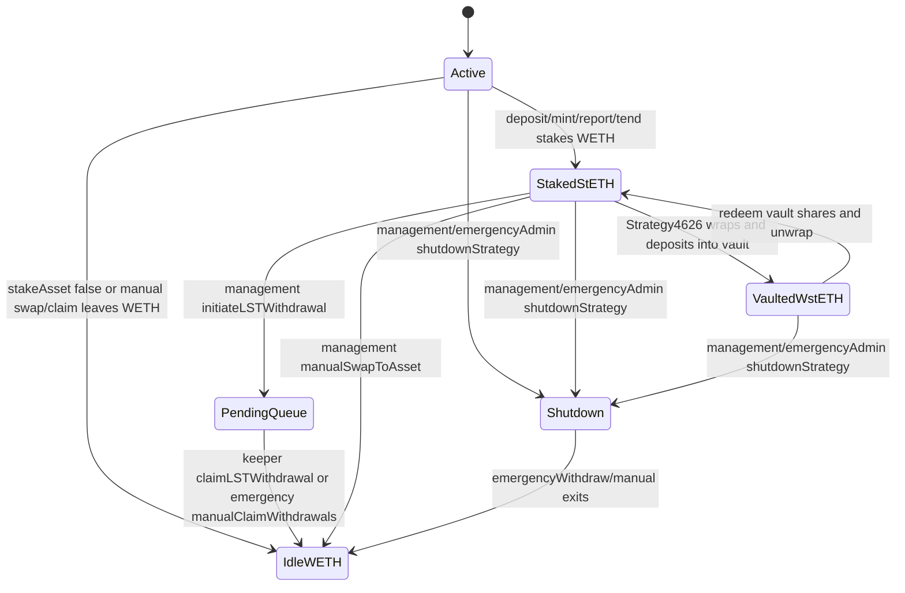

# Human Pages Contract Brief

## Run Scope

- Target repo: `/Users/dudesahn/Documents/GitHub/codex/review/steth-accumulator-strategy`
- Branch: `review`
- Output root: `.audit/human-pages/`
- Adapter: `/Users/dudesahn/Documents/GitHub/codex/skill-research/human-pages/SKILL.md`
- Source-only isolation: prior audit output paths are excluded. No `.scratchpad/` reads or writes.
- Excluded paths/patterns: `.audit/` except `.audit/human-pages/`, `.scratchpad/`, `x-ray/`, `AUDIT_REPORT-*`, `AUDIT_REPORT.md`, prior synthesis/finding/report artifacts, and `src/test/*PoC*.t.sol`.

## Contracts In Scope

Production source:

- `src/BaseLSTAccumulator.sol` - abstract Yearn V3 strategy extension for liquid staking token accumulation.
- `src/Strategy.sol` - stETH/WETH implementation using Lido direct staking, Curve ETH/stETH, and Lido withdrawal queue.
- `src/Strategy4626.sol` - extension that wraps stETH to wstETH and deposits into an external ERC4626 vault.
- `src/Strategy4626Factory.sol` - deploys Strategy4626 instances for ERC4626 vaults.
- `src/periphery/StrategyAprOracle.sol` - fixed APR oracle example.
- `src/interfaces/*.sol` - local external interfaces.

Key inherited framework source:

- `lib/tokenized-strategy/src/BaseStrategy.sol`
- `lib/tokenized-strategy/src/TokenizedStrategy.sol`
- `lib/tokenized-strategy-periphery/src/Bases/HealthCheck/BaseHealthCheck.sol`

Existing tests read for coverage context:

- `src/test/Operation.t.sol`
- `src/test/StethSpecific.t.sol`
- `src/test/WithdrawalQueue.t.sol`
- `src/test/Shutdown.t.sol`
- `src/test/Strategy4626.t.sol`
- `src/test/Strategy4626Factory.t.sol`
- `src/test/Oracle.t.sol`
- `src/test/FunctionSignature.t.sol`
- `src/test/utils/Setup.sol`
- `src/test/utils/Setup4626.sol`
- `src/test/mocks/MockWithdrawalQueue.sol`

Approximate local Solidity LOC in `src/` and `script/`: 2,562 lines, including tests and mocks. Production contract LOC is about 652 lines excluding interfaces and scripts.

## System Summary

This is a Yearn V3 TokenizedStrategy-based WETH strategy that accumulates stETH. User deposits WETH through inherited ERC4626 entry points. On deposit or keeper tend/report, the strategy may convert WETH to ETH and either route through Curve ETH/stETH if Curve quotes better than 1:1 or submit ETH to Lido for stETH. Withdrawals are intentionally liquid-only: `_freeFunds` is empty and `availableWithdrawLimit` returns only loose WETH, so management must swap/queue/claim stETH before users can withdraw from illiquid positions.

`Strategy4626` adds an ERC4626 vault layer by wrapping stETH to wstETH and depositing wstETH into a configured vault. To free stETH it redeems vault shares up to `vault.maxRedeem(address(this))`, unwraps wstETH, and then reuses the base stETH-to-WETH or Lido withdrawal-queue paths.

`Strategy4626Factory` creates one Strategy4626 per vault, configures management/keeper/emergency/performance-fee settings, sets performance fee and profit unlock time to zero, then stores `deployments[vault]`.

## Deployment Parameters

Mainnet addresses used directly:

- WETH asset: `0xC02aaA39b223FE8D0A0e5C4F27eAD9083C756Cc2`
- stETH LST: `0xae7ab96520DE3A18E5e111B5EaAb095312D7fE84`
- wstETH: `0x7f39C581F595B53c5cb19bD0b3f8dA6c935E2Ca0`
- Lido withdrawal queue: `0x889edC2eDab5f40e902b864aD4d7AdE8E412F9B1`
- Curve ETH/stETH pool: `0xDC24316b9AE028F1497c275EB9192a3Ea0f67022`
- Example Strategy4626 vault in scripts/tests: `0xE73b2561309Bed1035D2145275BCA1aEcf85A8F7`

Compiler/dependencies:

- `foundry.toml` pins `solc = "0.8.23"`.
- OpenZeppelin library version: `4.9.5`.
- Tokenized strategy and periphery are vendored under `lib/`.

## Roles

Inherited Yearn roles:

- `management`: can set strategy parameters, health-check limits, role addresses, performance fee recipient, profit unlock time, and local LST controls.
- `keeper`: can call `report`, `tend`, and this repo's `claimLSTWithdrawal`.
- `emergencyAdmin`: can call inherited `shutdownStrategy` / `emergencyWithdraw`, plus local emergency methods such as `manualClaimWithdrawals`, `manualRedeem`, and `manualUnwrap`.
- `pendingManagement`: must call `acceptManagement` to complete management transfer.

Factory roles:

- `management`: only address allowed to call `Strategy4626Factory.setAddresses`.
- Anyone can call `newStrategy4626(vault)` for a not-yet-deployed vault.

## State Machine

Important transitions:

- Deposit/mint is permissionless only when `openDeposits` or `allowed[receiver]` permits and the strategy is not shutdown.
- Withdraw/redeem is permissionless for share owners/approved spenders, but capped to loose WETH because `_freeFunds` is empty.
- `report` reverts while `pendingRedemptions != 0`.
- `clearPendingRedemptions` can unblock reporting but can force the next report to recognize losses if queue accounting was not actually resolved.
- `Strategy4626Factory.newStrategy4626` is public but one-per-vault.

## External Calls

Local strategy calls out to:

- WETH `withdraw(amount)` and `deposit{value: ...}()`.
- stETH `submit{value: amount}(referral)`.
- Curve pool `get_dy(...)` and `exchange{value: amount}(..., minOut)`.
- stETH ERC20 `forceApprove` to Curve and withdrawal queue.
- Lido withdrawal queue `requestWithdrawals`, `claimWithdrawal`, and `claimWithdrawals`.
- wstETH `wrap`, `unwrap`, `getWstETHByStETH`, `getStETHByWstETH`.
- External ERC4626 vault `asset`, `deposit`, `redeem`, `previewWithdraw`, `maxDeposit`, `maxRedeem`, `convertToAssets`, `balanceOf`.
- Yearn TokenizedStrategy fallback/delegatecall for ERC4626 shares, accounting, reports, tend, shutdown, roles, and fees.

## Existing Test Coverage Summary

- Normal deposits, reports, tend trigger/execution, and liquid withdrawals.
- Manual stake/swap, deposit-limit behavior, report buffer effects, and deposit whitelist controls.
- Lido withdrawal queue initiate/claim/manual claim/clear-pending flows using a mock queue.
- Shutdown and emergency withdraw conversion.
- Strategy4626 vault deposit, report inclusion, swap-via-redeem, and initiate withdrawal via vault redemption.
- Factory deployment, duplicate-vault rejection, wrong-vault-asset rejection, role configuration, and management-gated role updates.
- Function signature collisions and inherited role modifier smoke tests.

## Selected Human Pages Specialist Lanes

The user requested the following independent lanes:

- Recon/invariants
- SWC/access-control
- ERC20/reentrancy
- Economics/flash/composability
- DoS/griefing

The verifier lane will run after discovery to challenge candidates, attempt Foundry PoCs for High and meaningful Medium leads where feasible, and calibrate severity.

